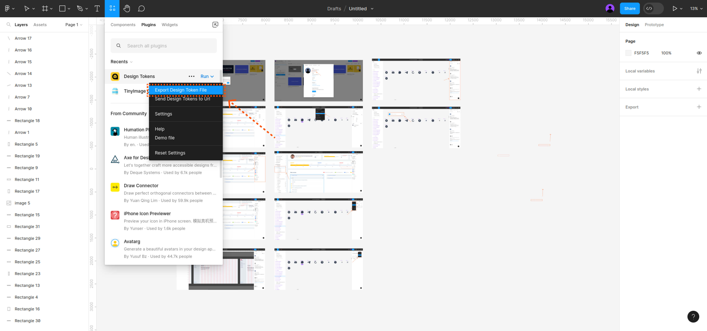
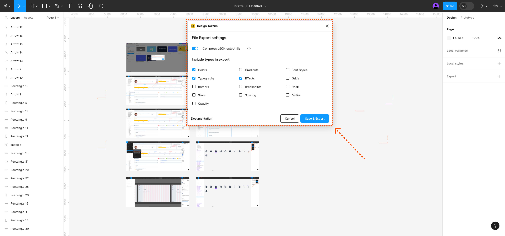
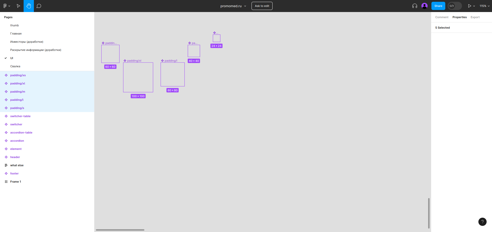

# Стандарт по работе с дизайн-токенами

# Design tokens

**Design tokens** — это набор базовых переменных визуального языка — отступы, цвета, типографика, стили объектов, анимация — представленный в виде данных.

Для выгрузки **design tokens** необходимо установить плагин **[Design Tokens](https://www.figma.com/community/plugin/888356646278934516/Design-Tokens)** и после выбрать в меню пункт с плагинами **Design tokens** и нажать кнопку **Run.**

 

При выгрузке **design tokens** можно выбрать много опций, но нам важны не все, а только:

* colors (основные и вспомогательные оттенки, готовые палитры)
* typography (шрифты, размеры заголовков/текста)
* effects (тени)

 

## Вертикальные отступы

Вертикальные отступы необходимо занести в переменные вручную.

 