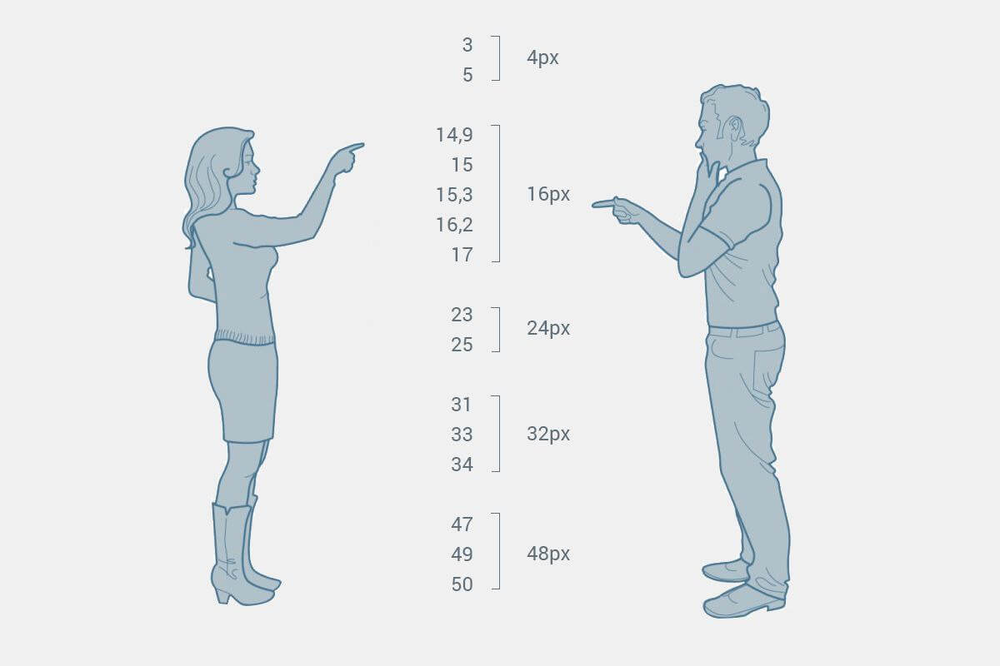
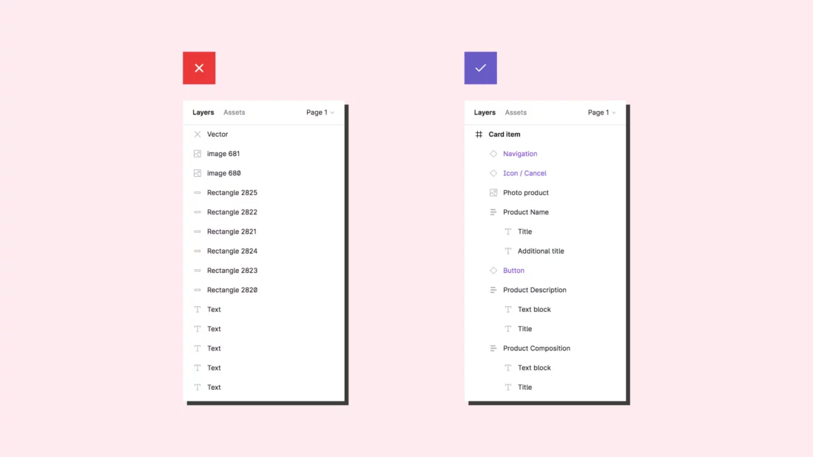
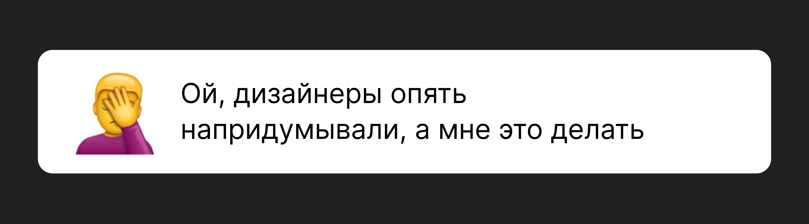
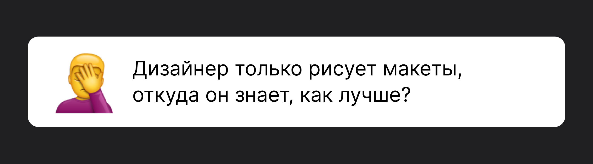
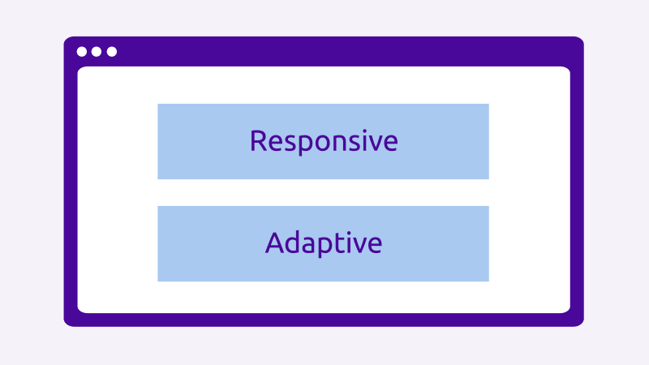

# Стандарт по работе с макетами/дизайнерами

## Этапы работы с макетом

Этапы взаимодействия дизайнера с разработчиком представляют собой последовательность действий, которые должны быть выполнены для того, чтобы дизайн-проект был реализован в полной мере. Ниже представлены основные этапы:

* оценить время работы над макетом и выявить основные проблемы (дубли компонентов, нехватка макетов с адаптивом) и сообщить об этом дизайнеру
* написать дизайнеру о том, что вы взяли в работу макет (можно через общий чат проекта или ПМ'а)
* \*процесс разработки\*
* перевод задачи в статус выполнено и уведомлении об этом ПМ'а

*Бывает, что есть макет от заказчика и внутренний макет, в приоритете всегда будет **внутренний** макет.*

*Перед началом работ на этапе оценки необходимо просмотреть весь макет и задать на все интересующие вопросы дизайнеру* — они не против 😉

Примеры вопросов:

* есть ли все состояния у полей форм, если таковые имеются?
* реализован ли макет с применением *design tokens*?
* какие брекпоинты будут на проекте? (в основном они не меняются, но если проект не с 0, то возможно использовались другие брекпоинты)

## Кейсы

 

Дизайнеры могут быть из сторонней компании и поэтому встречаются кейсы:

* если не совпадают отступы (например, слева 23px, а справа 24px), то лучше выберите чётное значение и написать об этом дизайнеру;
* если картинку с маской необходимо выгрузить без маски, а изображение обрезано по маске, то напишите об этом дизайнеру и попросите исходную картинку;
* если у блока ширина не округлена (например, 256.43px), то округлите самостоятельно и напишите об этом дизайнеру.

## Коммуникация

Общайтесь с дизайнером и задавайте вопросы. Чем больше вы знаете о том, что он хочет достичь в своих дизайнах, тем легче вам будет реализовать вёрстку макета.

## Реализация

Обратите внимание на графику и измерения. Некоторые макеты могут содержать элементы, которые вы, как разработчик, не можете воспроизвести точно так же, как на макете. В таких случаях обсудите с дизайнером, какие компромиссы можно сделать без потери качества.

## Структура

 

Для простой и удобной навигации в любом проекте будет выстроена понятная структура. Дизайнеры называют страницы и фреймы осмысленно.

Это позволяет коллегам понять логику макета и начать быстрее ориентироваться в структуре.

## Адаптив

Макеты для планшета рисуются, только по запросу фронта.

## Правки

Будьте готовы к изменениям и уточнениям. Макеты могут меняться и уточняться в процессе разработки. Старайтесь следить за обновлениями от дизайнера и быть готовыми к их реализации.

*Если вы вносите правку, которой ещё нет на макете, то после правки напишите дизайнеру, чтобы он внёс её на макете.*

## Решение проблем

 

Если возникают разногласия или непонимание между вами и дизайнером, постарайтесь проконсультироваться с другими разработчиками или другими профессионалами, чтобы найти решение проблемы.\n\n*Реальный контент может отличается от текста на макете, поэтому нужно учитывать переполнение контента.*

 

Этот миф распространен у разработчиков. 

# Дополнительно

## Дизайнеры

Дизайнеры —  люди, которые прорабатывают макет не только чтобы он смотрелся красиво и современно, но и чтобы им было удобно пользоваться. Они знают множество паттернов поведения пользователя, сочетания цветов и форм, о которых мы не догадываемся, поэтому совет здесь такой: больше доверяйте своему коллеге — он наверняка знает, что делает.

Если на макете есть неявное поведение, то дизайнер оставит комментарий. 

Не стесняйтесь задать вопрос дизайнеру, если что-то непонятно.

Если по опыту видите, что в макет нужно внести правки, сначала обсудите их с дизайнером. Любые изменения нужно согласовать.

Не бойтесь обсуждать дизайн и давать конструктивные комментарии. Если видите, что что-то нельзя реализовать, объясните, почему именно и чем можно заменить.

## Разновидность веб-дизайна

 

Отзывчивый веб-дизайн (Responsive Web Design) — разновидность дизайна в котором переходы между вариантами отображения плавные. Блоки перестраиваются в зависимости от ширины экрана. Данный вариант отлично смотрится на любых устройствах, однако он чуть сложнее в реализации, чем адаптивный.

Адаптивный веб-дизайн (Adaptive Web Design )— разновидность дизайна в котором отталкиваясь от типов устройств, выделяются ключевые точки (варианты отображения), между которыми происходит резкий переход. Этот вид легче в реализации, однако сайт будет меняться «рывками» при переключении от одного отображения к другому.

## UX

User Experience (опыт пользователя) — то, какой опыт/впечатление получает пользователь от работы с интерфейсом. Удается ли ему достичь цели и на сколько просто или сложно это сделать.

## UI-кит 

UI-кит — набор готовых решений пользовательского интерфейса. Это могут быть кнопки, поля ввода, «хлебные крошки», меню, переключатели, формы — все те элементы, что помогают пользователям взаимодействовать с сайтом или приложением.

## Растровая графика 

Растровое изображение, как мозаика, складывается из множества маленьких ячеек — пикселей, где каждый пиксель содержит информацию о цвете.\n*Пример форматов: JPEG, PNG, WebP.*

## Векторная графика

В отличие от растровых, векторные изображения состоят не из пикселей, а из множества опорных точек и соединяющих их кривых. Векторное изображение описывается математическими формулами.

*Пример форматов: SVG, AI.*\n\n**P.S. Фронтендер и дизайнер решают общую задачу.**