# Figma

##  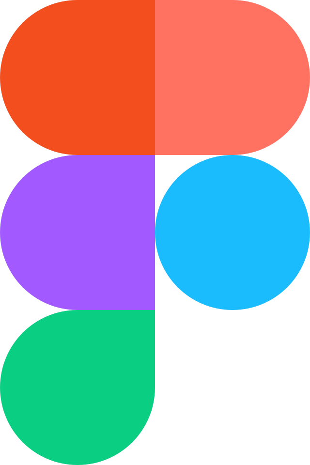Кратко

Figma — это графический редактор. В нём может работать вся команда одновременно. Изменения макета сохраняются в облаке, поэтому каждый участник всегда видит актуальную версию дизайна.

## Для чего нужна Figma?

Редактор предназначен для создания прототипов сайтов или приложений, иллюстраций и векторной графики. В редакторе можно настроить совместную работу, вносить и обсуждать правки.

## Как работать с Figma?

В сервисе можно работать из браузера (работает на WebGL) или скачать приложение с официального сайта Figma на компьютер (Windows / Mac / неофициальное решение Linux). Выбирайте браузер (рекомендуется использовать Google Chrome), если часто пользуетесь разными устройствами.\nВсе разработчики авторизованы под одним аккаунтом, доступ к которому вы можете найти [здесь](https://bw.w6p.ru/).

## Интерфейс

После регистрации доступны две рабочие области — графический редактор и менеджер файлов, в котором можно создавать проекты и изменять настройки профиля.

*Важно, что Figma сохраняет историю изменений каждого файла. Вы легко сможете восстановить резервную копию вашей работы.*\nЧтобы скрыть элементы управления, то нажмите `Ctr + \`

## Панель управления

В самом вверху находится панель управления с инструментами.

## Комментарии

В меню есть пункт **Add/Show comments** — Добавить / показать комментарии.

Нажав на иконку комментариев, вы сможете просматривать чужие комментарии и добавлять свои.

 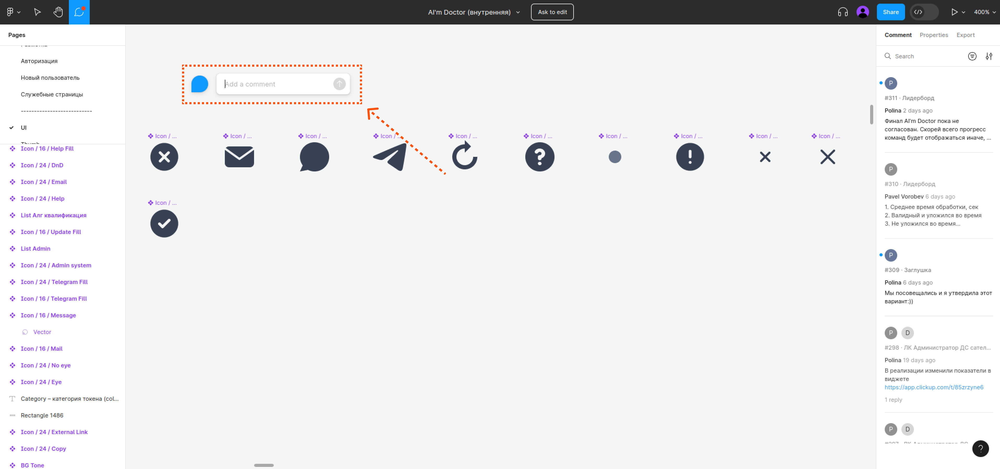

Нажмите на какую-то область левой кнопкой мыши, напишите что-то и нажмите кнопку. Все комментарии будут отображаться в проекте, а также в панели с правой стороны.

 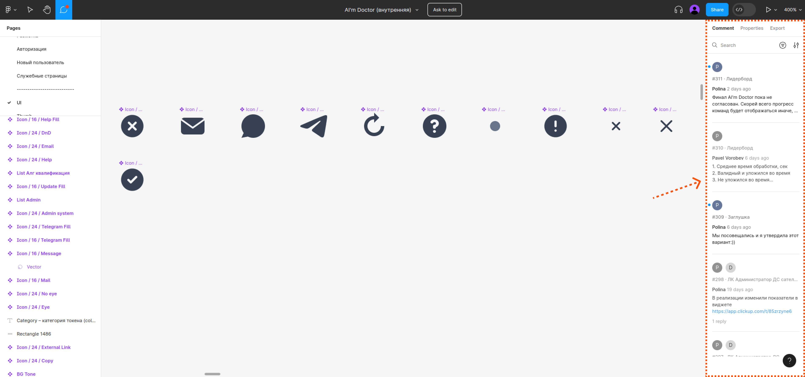

## Поиск

Поиск (вкладка Search) ищет пункты меню, а не элементы, которые вы создавали. Пригодится, если вам нужна конкретная команда, но вы забыли, где именно она находится.

Если вы нажмете на надпись **Search**, то сверху по центру поле, где вы можете осуществлять поиск.

 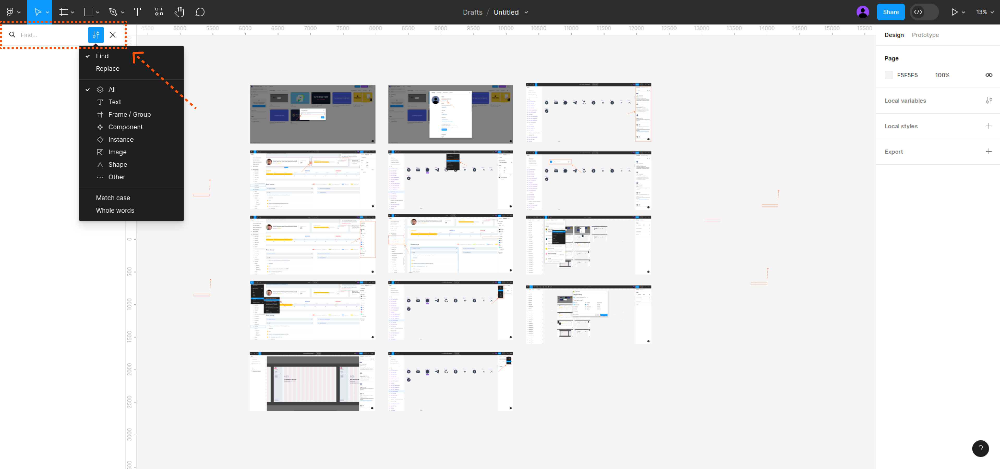

Здесь можно осуществлять поиск по следующим вкладкам:

* файлы
* проекты
* люди
* плагины и файлы в сообществе figma
* файлы в черновиках и командах
* и т.д.

## Режим Dev mode

 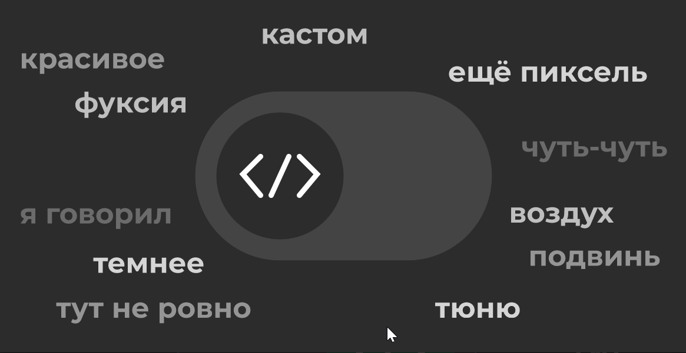

Чтобы включить *Dev mode* необходимо нажать переключатель.

 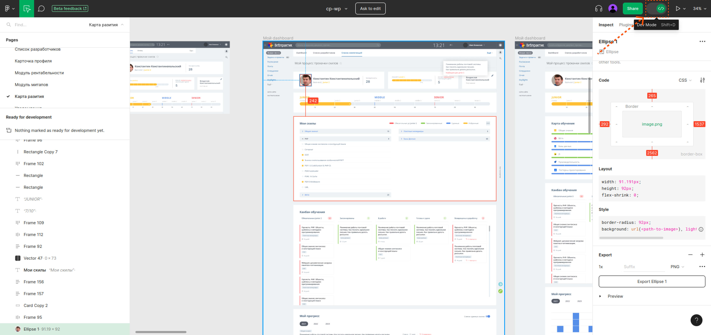

В режиме Dev mode при выборе элемента можно посмотреть его CSS.

 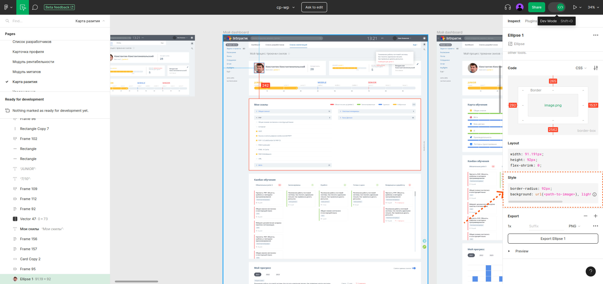

При наведении на блок появится кнопка **Copy,** которая позваоляет копировать значения из блока.

 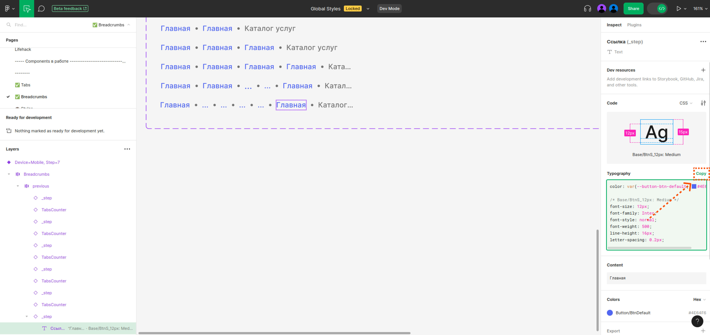

В панели слева мы сразу видим страницы, на которых есть экраны, готовые к разработке. Они помечены зелёной иконкой.

 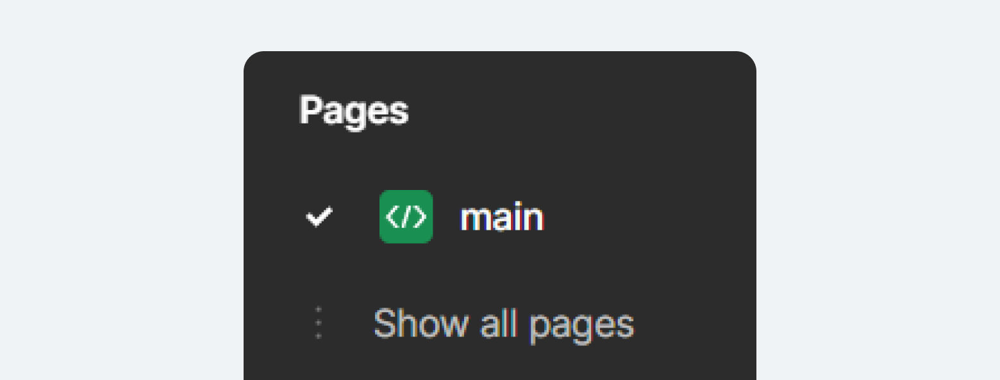

Остальные страницы скрыты и не мешаются. Ниже идёт раздел **Ready for development.** Это список готовых фреймов. Под каждой миниатюрой — время последнего изменения. 

 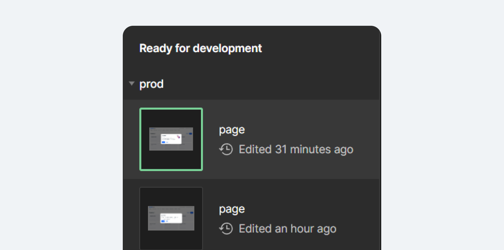

Кликая по миниатюрам, можно переходить к готовым страницам. Теперь посмотрим направо. Там находится основная панель разработчика.

 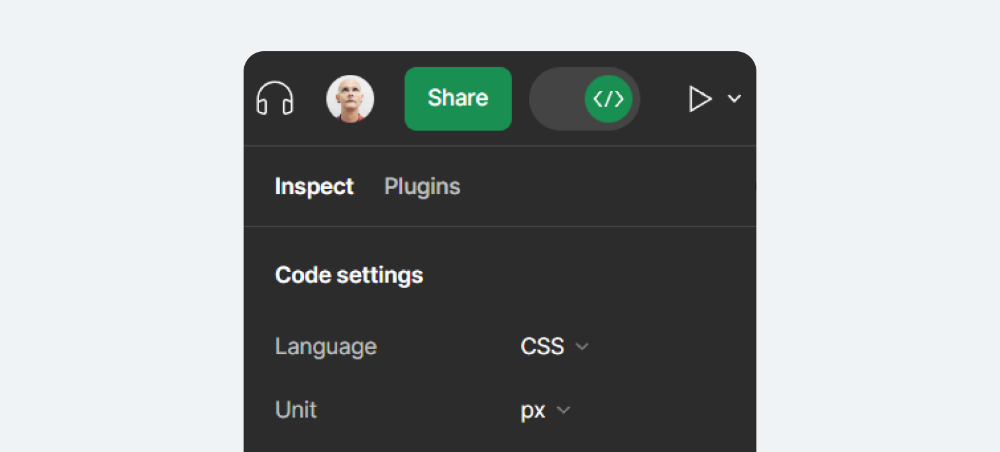

Кнопка **Compare changes** вызывает окно сравнения версий.

 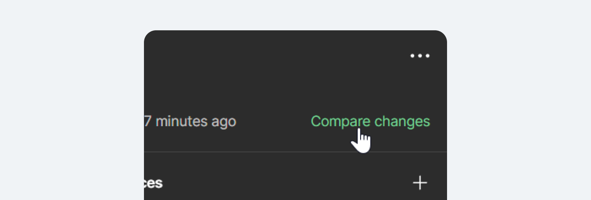

Слева находится история. Можно переключится к предыдущим версиям выделенного фрейма и сравнивать их с текущей.

 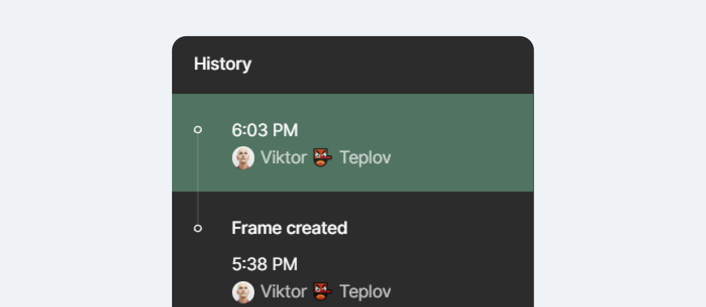

Под панелями сравнения находится список изменений. Можно выделить слой и посмотреть, что с ним произошло. Как изменился его размер, цвет и т. д.

 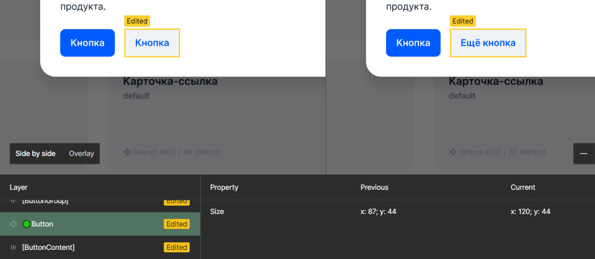

Можно переключиться в режим наложения (Overlay) и визуально оценить различия.

 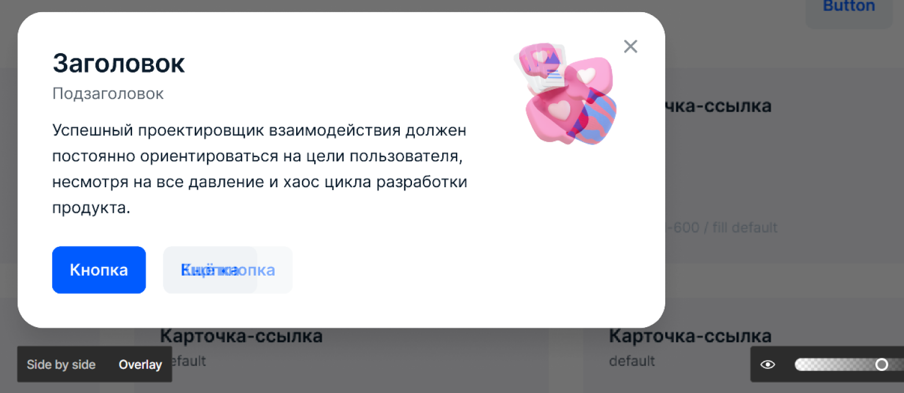

Это нововведение меняет правила игры. Теперь дизайнеру не нужно составлять список доработок, а разработчику — попиксельно сравнивать макеты. **Все изменения фиксируются и документируются.**

## Dev mode. Inspect

Выделим один из фреймов. Панель **Inspect** показывает информацию про все вложенные сущности. Это размеры, отступы, цвета и ассеты (компоненты, картинки, иконки). 

 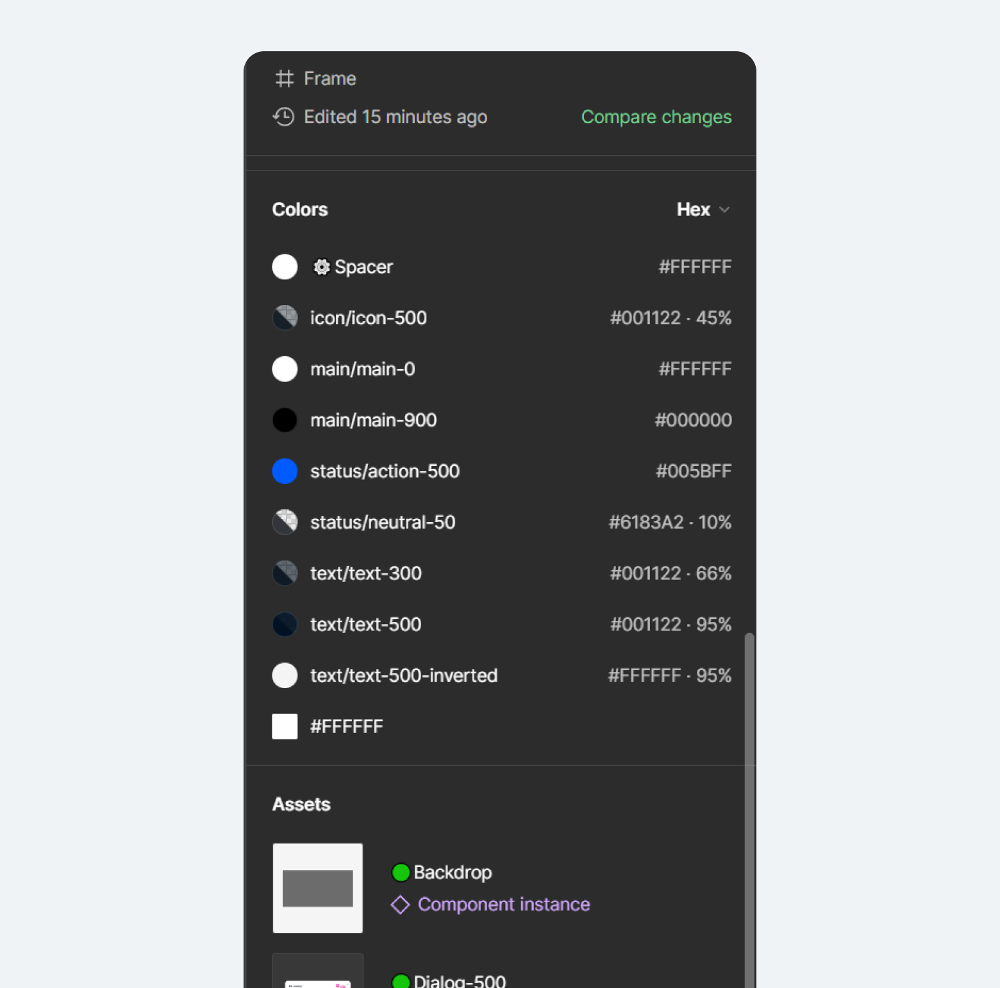

Наведёмся на один из цветов, и Figma подсветит, где использован этот цвет в макете. 

 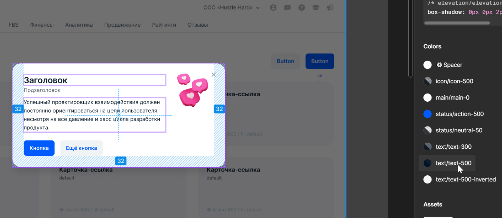

С каждым кликом мы погружаемся вглубь экрана. Нас особенно интересуют компоненты дизайн-системы. И вот, добравшись до кнопки, мы видим все её настройки, стили и токены.

 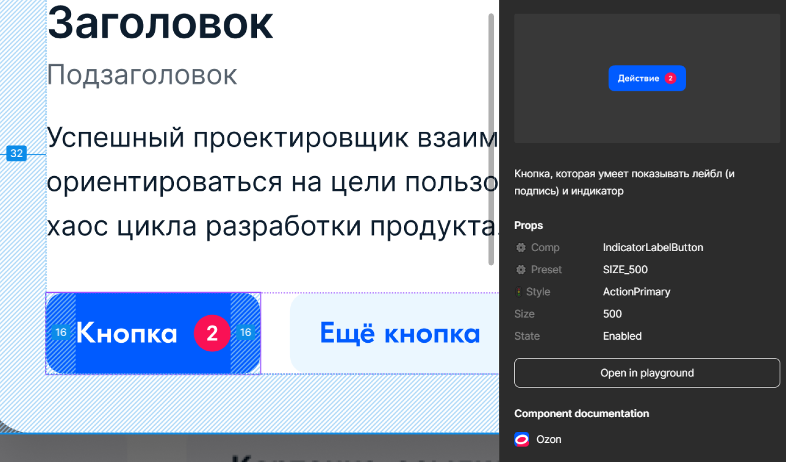

## Sharing

Если хотите поделиться вашим проектом, то нажмите кнопку **Share** сверху, справа. Там есть ссылки, чтобы поделиться **copy link**.

Если вы выбрали определённую страницу, при переходе по ссылке откроется именно эта страница.

Ссылка на фрейм передаётся в виде параметра **node-id** -— figma.com/file/**node-id=294%3A**

## Инструмент Pick color

Нажмите клавишу `I`, чтобы показать пипетку.

## Инструмент линейки

Чтобы включить линейки используйте сочетание клавиш `Ctrl + R`.

## Масштабирование и параметры просмотра

Если необходимо вернуться к 100%, то существует комбинация `Ctrl + 0`

## Режим Outline (векторные контуры)

В Figma есть режим `Outline view`. Его удобно использовать для работы с размерами фреймов и для понимания, из чего состоит векторная форма.

В этом режиме видны только векторные контуры слоёв без учёта обводок и заливок.

* фреймы показываются пунктиром. У шейпов видны скругления;
* наконечники стрелок не показываются;
* у текстовых слоёв видны шейпы букв, но не видны боксы.

Показать/Скрыть — `Shift + O`

## Функция highlight layers on hover

Лучше держать включенным всегда — функция подсвечивает мелкие элементы дизайна при наведении: кнопки, буквы, иконки, значки.

 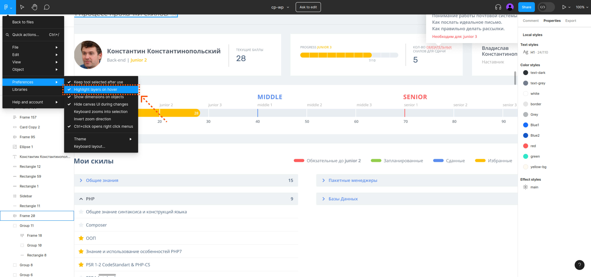

## Инструмент layout grids

Чтобы показать колонки нажмите сочетание клавиш `Shift + G`. Колонки добавляет дизайнер, поэтому их может и не быть.

 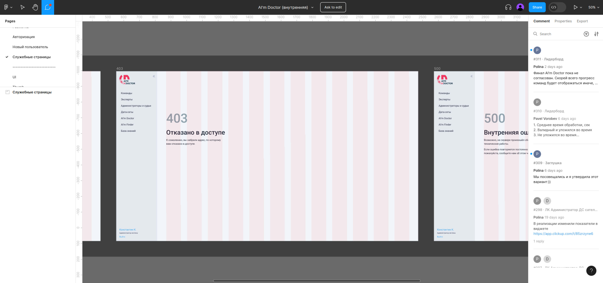

## Расстояния между элементами

Чтобы посмотреть расстояние между двумя элементами, то ;нужно кликнуть по одному элементу и после навести курсор на другой и зажать клавишу `alt`.

 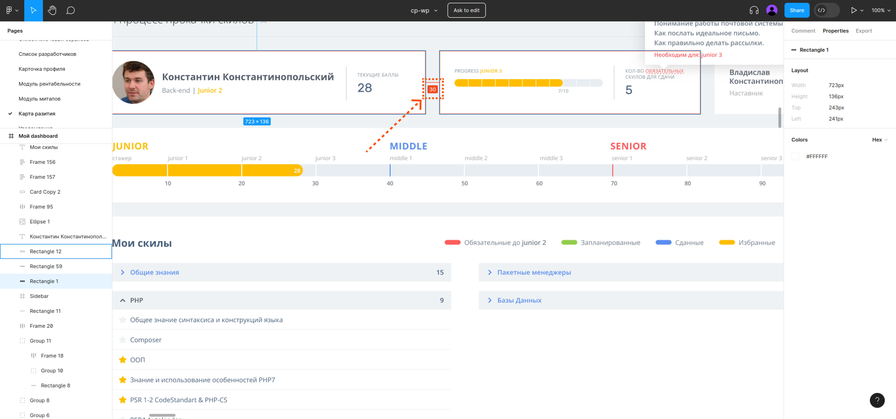

## Панель страниц и слоёв (слева)

Состоит из двух вкладок:

* pages
* components

 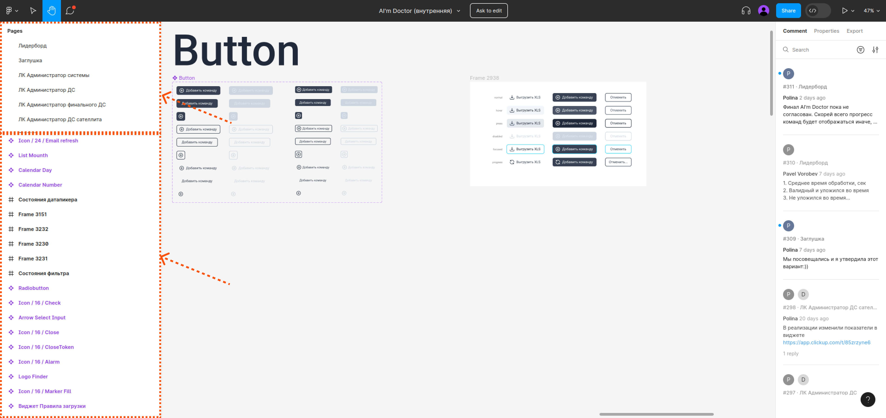

Pages — секции, в которых содержатся наши экраны. Удобны для группировки их по смыслу. В каждой странице своя бесконечная координатная плоскость.

Чтобы удобно переключатся между макетами можно нажимать клавишу `N` и `Shift + N` для возврата на предыдущую страницу

Components — список всех слоёв, которые существуют в рабочей области. У каждого слоя есть контекстное меню, где можно подсмотреть большинство горячих клавиш.

Если убрать фокус с элементов, то будут отображаться local styles.

 

## Страница UI

User Interface (пользовательский интерфейс) — то, как выглядит интерфейс и то, какие физические характеристики приобретает.

Все UI компоненты находятся на соответствующей странице.

Здесь находятся:\n

* кнопки и группы кнопок
* чекбоксы
* поля ввода
* иконки
* пагинация
* переключатели
* попапы\n

  У каждого элемента может быть несколько состояний, которые помогают пользователям понять интерфейс.

  \
  Так как эту страницу дизайнер создаёт вручную, то при отсутвии её просьба написать дизайнеру или ПМ'у.

 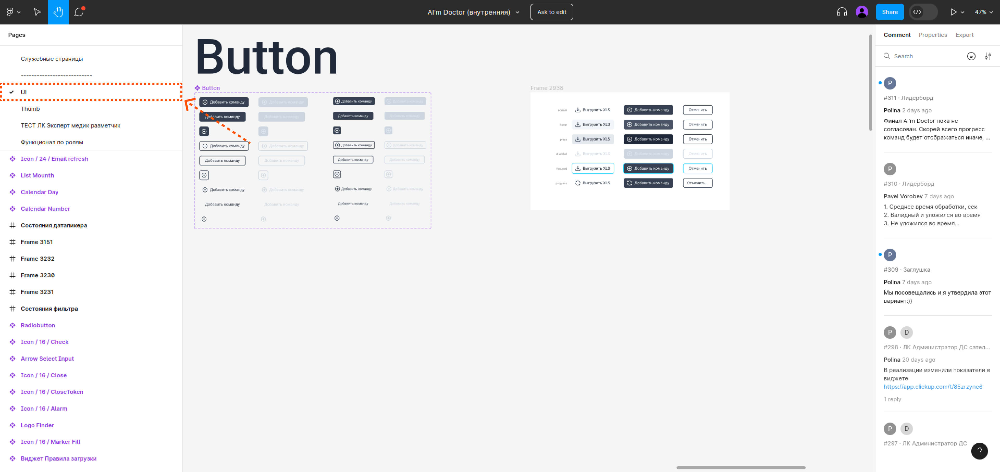

Компоненты со страницы UI используются по всему проекту и чтобы на какой-либо странице перейти к нему, необходим нажать правую кнопку мыши и выбрать в меню **Go to main component**.

 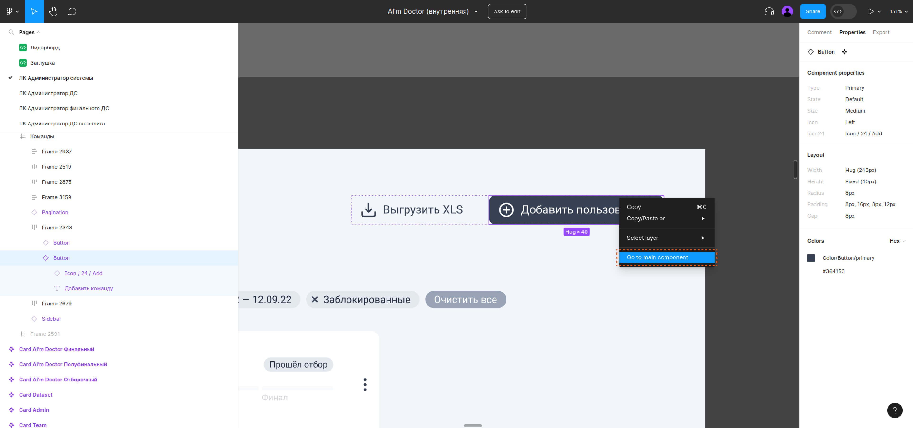

## Панель свойств (справа)

В правой части интерфейса видна большая белая панель во всю высоту окна — панель свойств. В зависимости от выделенного типа слоя в ней может быть разный набор полей и кнопок.

*Если ни один слой не выбран, мы видим local styles проекта.*

 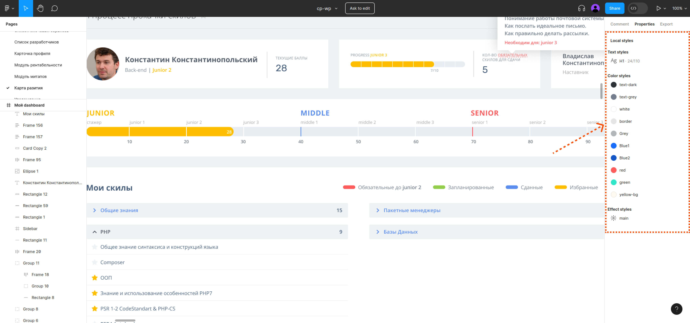

## Frames

Frames — это основной элемент дизайна, выступающий в качестве контейнера верхнего уровня, представляющего разделы или компоненты в дизайне макета. Frames очень важны при работе с сеткой. Им можно задавать единые стили сеток, которые можно использовать по всему файлу.

 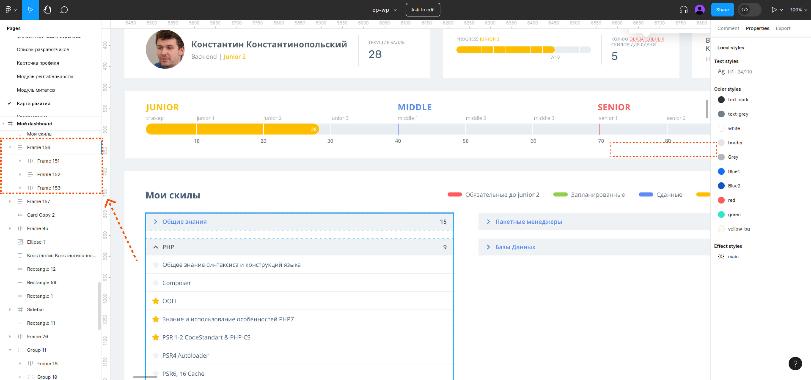

Чтобы сверунть все фреймы используйте сочетание клваиш `Ctrl + L`

## Группы

Группы в Figma помогают интегрировать/объединять воедино несколько похожих компонентов. Поскольку границы группы определяются ее дочерними компонентами, изменение размера или перемещение этих компонентов приведет к автоматической корректировке границ группы.

## Инструмент перемещения по макету

Изначально активен инструмент **Move**. Если выбрать другой, то на предыдущий можно вернуться, нажав `Esc`.

Активировав инструмент рука (Move), вы сможете перемещаться в любую сторону по вашему проекту. Удобнее нажимать пробел, чтобы активировать этот инструмент.

## Темизация

Разные продукты используют свои темы оформления. Любая тема наследуется от базовой, но меняет значения некоторых переменных. Design tokens будут с префиксом **dark**.

## Экспорт

В Figma можно экспортировать все элементы на макете, но в основном требуется экспортировать графику. Вы можете экспортировать отдельные файлы или фрейм, в котором они собраны. Меню экспорта находится в панели справа. 

Если необходимо выгрузить множество картинок (например, иконок), то можно выделить необходимые картинки курсором и также нажать кнопку **Export **и у вас выгрузится архив с этими иконками.\n\n 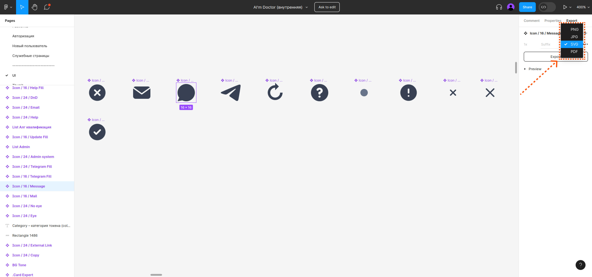

Также при экспорте можно выбрать плотность экрана. Необходимо выбирать **2x**.

 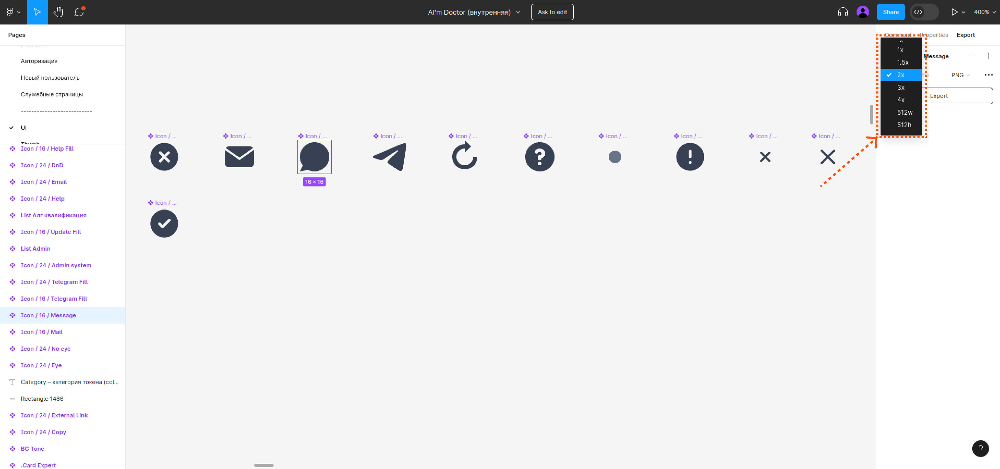

Вызывать окно экспорта можно сочетанием клавиш `Ctrl + Shift + E`

*Изображения необходимо экспортировать в исходном формате, то есть не нужно экспортировать изображения PNG в формат SVG.*

Чтобы экспортировать исходное изображения, то нужно выделать картинку и в правой колонки свойств навести на картинку в **Assets**, чтобы появилась иконка для экспорта.

 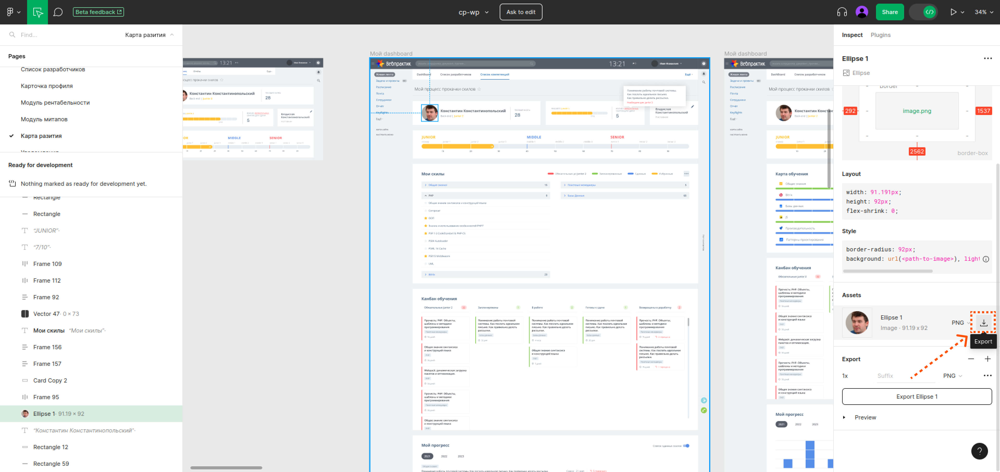

Экспортировать иконки необходимо в одном размере фрейма. Например, все иконки 32x32.

 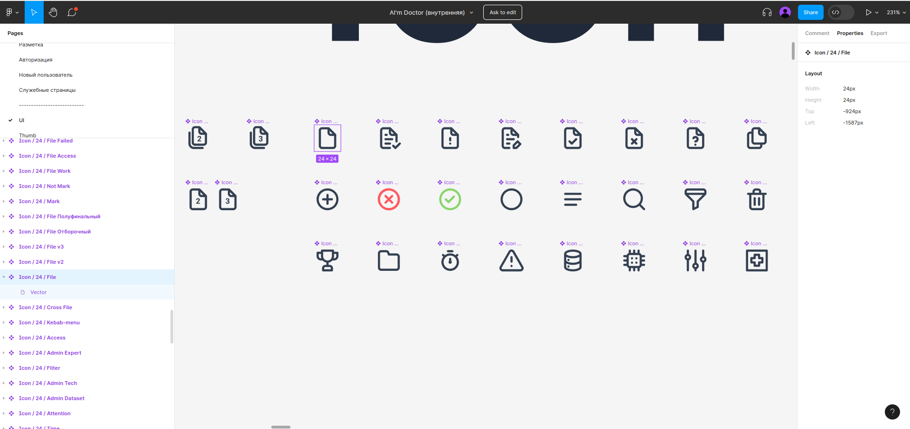

# FAQ

## Как узнать кто просматривает или работает в проекте?

Сверху и справа есть аватарки тех пользователей, которые просматривают этот проект или работают в нём.

## Можно ли сделать экспорт фрейма в SVG, чтобы и при этом текст в нём не преобразовался в кривые и остался редактируемым?

Для этого можно в настройках экспорта можно снять галочку **Outline text**.

# Дополнительно

## Копирование макета

В предоставленных макетах не будет доступа для редактирования и есть возможность сделать копию, которой уже можно манипулировать.

 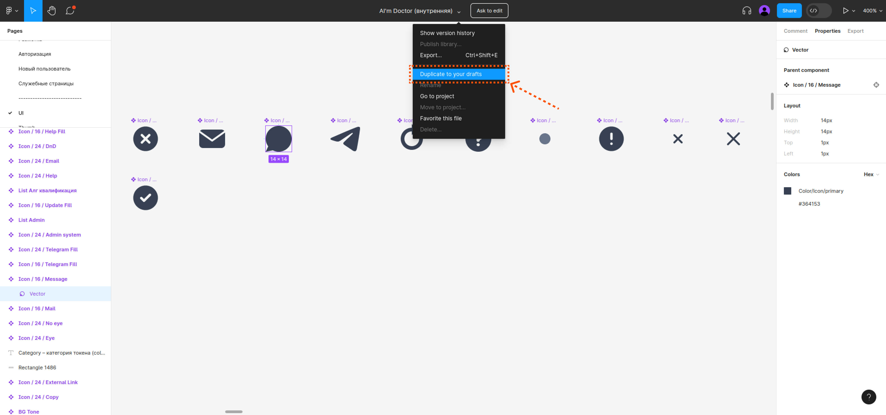

*Важная очевидность, что при внесении изменний дизайнером в макет они не будут отображатся в копии.*

## Multiplayer cursor

Иногда, одновременно макет могут просматривать множество людей и по умолчанию будут видно их курсоры. Можно отключить видимость этих курсоров.

 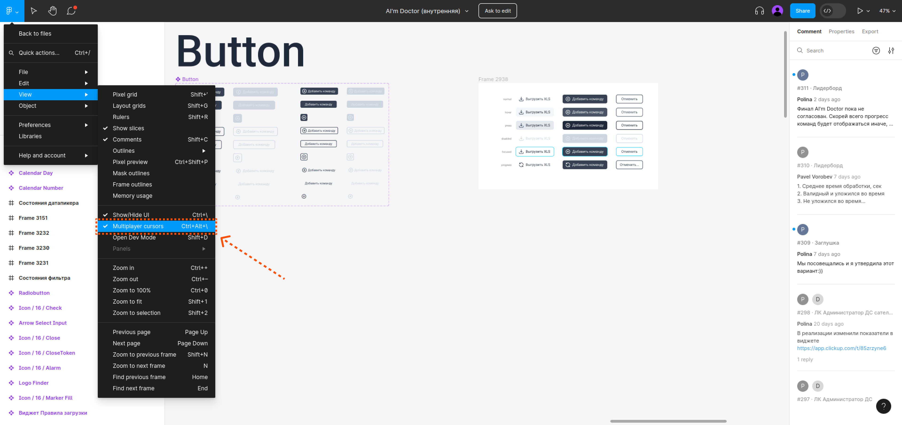

## Маски

Маски позволяют брать одну векторную фигуру и по её форме делать видимой другую.

## Pixel Preview

Режим, в котором видны пиксели в плотности 1х или любом другом, настроенном в выпадающем поле.

## Шрифты

Figma может использовать шрифты, установленные в операционной системе, как в редакторе, так и в браузере.

Если используется клиент, после установки нового шрифта он не виден в шрифтах. Чтобы это исправить, нужно выйти и заново войти в приложение Figma. Чтобы шрифты отображались в браузере, нужно приложение Font Helper.

## Режим презентации

Чтобы перейти в режим презентации, нажмите на иконку треугольника сверху и справа. Иконка похожа на **play**.

В этом режиме будут отображаться созданные вами фреймы. Можно переключаться между ними нажимая на стрелки клавиатуры.

В этом режиме также можно добавлять комментарии, нажав на иконку слева и сверху. После публикации комментариев, вы увидите уведомление на главном экране Figma.\nВ режиме презентации можно посмотреть анимации.

## Быстро найти нужный плагин/функцию

Если у вас установлено уже очень много плагинов и найти нужный в стандартном меню стало невозможно, воспользуйтесь внутренним поиском в Figma. Для этого нажмите на `Ctrl + P`  — откроется поисковая строка, которая ищет не только установленные плагины, но и стандартные функции редактора.

# Полезные ресурсы

* [Новости о Figma](https://www.figma.com/whats-new/)
* [Канал с видео о Figma](https://www.youtube.com/c/Figmadesign/videos)